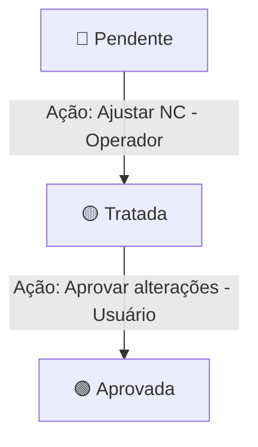

# Regras de Negócio — Interjato Dashboard (SGI)

Este documento descreve as regras de negócio de alto nível, os fluxos de trabalho e as permissões de acesso por perfil de usuário implementadas no **Sistema de Gestão Integrado (SGI)** da Interjato.

---

## 1. Perfis de Usuário e Matriz de Permissões (RBAC)

O sistema conta com quatro perfis principais de usuários que possuem responsabilidades e acessos estritos sobre os documentos e o tratamento de não-conformidades.

| Perfil de Usuário | Permissões em Documentos | Permissões em Não-Conformidades (NCs) |
| :--- | :--- | :--- |
| **Administrador (`admin`)** | Leitura, revisão (operacional) e aprovação de revisões de documentos. | Registro, correção/tratamento e aprovação de tratamentos de NCs. |
| **Auditor (`auditor`)** | Leitura de documentos. Botões de auditoria exclusivos liberados. | Apenas visualização de registros e status das NCs. Não pode alterar estados. |
| **Operador (`operador` / `operator`)** | Leitura de documentos e responsabilidade de revisar o documento (marcação de check). | Capacidade de corrigir e aplicar tratamento a NCs registradas. |
| **Usuário (`user`)** | Leitura e capacidade de aprovar ou desaprovar revisões concluídas. | Analisa ações corretivas dos operadores e aprova tratamento de NCs. |

---

## 2. Fluxo de Vida e Estados de Documentação (SGI)

Qualquer documento importado ou presente no sistema possui um fluxo de transição de status dependente da cooperação entre o **Operador** e o **Usuário**:

### Fase 1: Pendente para Revisão (Visão do Operador)
* **Condição:** Documento pendente de aprovação (`approvedBy === "Não identificado"`) e que ainda precisa de revisão técnica (`needsReview === true`).
* **Mensagem exibida no card (para Operadores):** `"Pendente para revisão"`.
* **Ação:** O Operador analisa o documento e marca o checkbox de revisão.

### Fase 2: Pendente para Aprovação (Transição)
* **Condição:** O documento já foi revisado pelo Operador (`needsReview === false`), mas ainda não possui aprovação final.
* **Mensagem exibida no card (para Operadores e Usuários):** `"Pendente para aprovação"`.
* **Regra de Bloqueio:** Para o perfil **Usuário**, o botão **"Aprovar esta Revisão"** fica desabilitado até que o Operador conclua a fase de revisão (`needsReview` seja alterado para `false`). Caso o documento ainda precise de revisão, o Usuário verá a mensagem `"Aguardando revisão operacional"`.

### Fase 3: Aprovado
* **Condição:** O usuário (`user`) clica no botão **"Aprovar esta Revisão"**.
* **Armazenamento:** O campo `approvedBy` é preenchido com o **Nome Completo** do usuário que aprovou o documento (e não a função/cargo dele).
* **Mensagem exibida no card:** `"Aprovado por: <Nome do Usuário Logado>"`.

---

## 3. Gestão e Fluxo de Não-Conformidades (NCs)

O ciclo de vida das Não-Conformidades garante que os desvios apontados nas auditorias sejam corrigidos tecnicamente e validados pelos gestores.

### 🔴 Status: Pendente (Sinal Vermelho)
* **Origem:** Registrado exclusivamente pelo **Auditor** através do botão **"Registrar Não-Conformidade"** nos cards do dashboard. Ele preenche a data, o documento afetado e a descrição detalhada do desvio (limite de até 5000 caracteres).
* **Comportamento na tela de NCs:** Exibido com o emoji `🔴 Pendente`.
* **Ação Requerida:** Aguarda que um **Operador** tome uma ação corretiva.

### 🟡 Status: Tratada (Sinal Amarelo)
* **Origem:** O **Operador** localiza a NC pendente e clica no botão de ação **"Ajustar NC"** na respectiva linha.
* **Ação:** Abre-se o formulário *"Ajuste de Não-Conformidade"*. O operador digita na área de texto explicando detalhadamente a ação corretiva realizada.
* **Mudança de Estado:** O sistema registra automaticamente:
  * A descrição do ajuste (`treatmentDesc`).
  * O nome do operador que realizou a correção (`operatorName`).
  * A data e hora exata da correção (`treatmentDate`).
  * Envia as informações para o arquivo/tabela de logs de auditoria do sistema.
  * Altera o status visual para o emoji `🟡 Tratada`.

### 🟢 Status: Aprovada (Sinal Verde)
* **Origem:** O **Usuário** (gestor do processo) visualiza a NC que foi tratada e analisa a explicação do operador.
* **Ação:** O usuário clica no botão de ação **"Aprovar alterações nas não-conformidades"**.
* **Mudança de Estado:** O sistema registra o nome de quem aprovou e a data da aprovação. O status visual é alterado para `🟢 Aprovada` (Solucionada), encerrando o ciclo de vida do desvio.

---

## 4. Auditoria e Logs do Sistema
* Toda e qualquer ação de revisão, aprovação, rejeição, criação ou tratamento de não-conformidade gera uma entrada única de auditoria no banco de dados (`AuditLog`), registrando o autor, data, hora, tipo de evento e os detalhes do documento ou não-conformidade afetada para posterior consulta de auditoria do SGI.

---

## 5. Diretrizes Visuais e Interface de Usuário (UI)
* **Tipografia:** Fonte única integrada de ponta a ponta na aplicação: **Oxanium** (Google Fonts).
* **Responsividade:** Layout em grade responsiva dinâmica para exibição otimizada dos gráficos e cards em diferentes resoluções.
* **Gráficos (Recharts):**
  * Primeira Linha (Formatos Donut/Rosca): *Leitura dos Documentos*, *Status das Revisões* e *Status de Aprovação*.
  * Segunda Linha (Formatos de Barras): *Não-Conformidades (NCs)* e *Auditoria (LIDO PELO AUDITOR)*.
